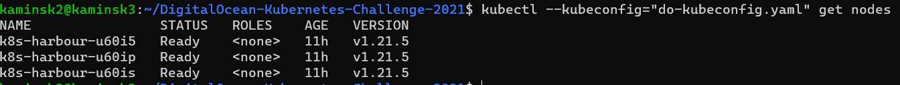

# DigitalOcean-Kubernetes-Challenge-2021

## Intro

I'm Chris and I've been using Docker and Docker Swarm for some time. Kubernetes is a new world to me.

On Bret Fisher Youtube show [Course Q&A: DevOps and Docker Live Show (Ep 151)](https://www.youtube.com/watch?v=UG_oeZO2uqQ) I've heard about DigitalOcean Kubernetes Challenge. As I've been meaning to dip my toes into k8s and started watching k8s course that was a perfect push to do something in practice.

Beeing beginner in kubernetes I thought that DO might be perfect as motto on homepage says "The cloud is complex. We make it simple."
I've heard great things about DigitalOcean siplicity and awesome interface so it's finally time.

Let's give it a try then.

## Creating DO account

Account registration took me some time. For some reason I was unable to register an account using Brave on android phone.
After couple of tries I reached for laptop.

I have registered DO account but after email, captcha and Paypal verification but my account got admin locked. I guess they did not liked Revolut card I tried to use or previous registration attempts from phone got flagged.

I have reached to support and they were able to unlock the account in a matter of 3.5 h.

## Project - Deploy an internal container registry

I have chosen container registry as MVP. 

"Kubernetes does not provide an internal container registry but it is often useful to add one. There are many projects which enable you to deploy an internal container registry, such as Harbour or Trow."

Harbor it is then. 

## Necessary tools

We will need two binaries to manage kubernetes cluster and deploy our app:
- kubectl
- helm

### kubectl

Let's install them using official docs and check installed version

```bash
$ curl -LO "https://dl.k8s.io/release/$(curl -L -s https://dl.k8s.io/release/stable.txt)/bin/linux/amd64/kubectl"

$ sudo install -o root -g root -m 0755 kubectl /usr/local/bin/kubectl

$ kubectl version --client

```


### helm

Quoting helm docs:

Helm now has an installer script that will automatically grab the latest version of Helm and install it locally.

You can fetch that script, and then execute it locally. It's well documented so that you can read through it and understand what it is doing before you run it.

```bash
$ curl -fsSL -o get_helm.sh https://raw.githubusercontent.com/helm/helm/main/scripts/get-helm-3
$ chmod 700 get_helm.sh
$ ./get_helm.sh
```

Yes, you can `curl https://raw.githubusercontent.com/helm/helm/main/scripts/get-helm-3 | bash` if you want to live on the edge.

I live on the edge so:


## Creating DigitalOcean managed kubernetes cluster and deploying Harbor

I have created new project then it's just a matter of clicking big green create button and choosing Kubernetes:


I went with the default settings as I think that Digital Ocean engineers thought it out and if you are learning new platform that's what you should start with.

The only change which made sense in this case was datacenter region.

As I live in Poland and mean to use this cluster for testing other container workloads apart from this challenge I chose Frankfurt


### Quickstar wizard

We will go through 4 steps of quickstart wizard:


DigitalOcean offers quickstart which helps you connect to your new cluster either using `doctl` or dowloading kubeconfig file manually.


For simplicity sake I chose manual option

First download the cluster configuration file clicking on link


We can test connection (if the cluster has already finish provisioning) using provided command with slight modification as I have renamed downloaded file:

`kubectl --kubeconfig="do-kubeconfig.yaml" get nodes`



Patch & minor version upgrades section let's you chose what kind of upgrades will be performed and when.

I like to be safe so patch and minor versions for me, please.


DO offers Marketplace of 1-Click Apps which can be deployed to your cluster, we will skip this part.


### Deploying Harbor

Harbor is an open source registry that secures artifacts with policies and role-based access control, ensures images are scanned and free from vulnerabilities, and signs images as trusted. Harbor, a CNCF Graduated project, delivers compliance, performance, and interoperability to help you consistently and securely manage artifacts across cloud native compute platforms like Kubernetes and Docker.

To deploy harbor we will use official helm chart.

First we need to download it and unpack:

```bash
$ helm repo add harbor https://helm.goharbor.io
$ helm fetch harbor/harbor --untar
```
Then to deploy it we specify kubeconfig file 

```bash
$ helm install --kubeconfig=do-kubeconfig.yaml \
--set=expose.type=nodePort \ 
--set=expose.tls.enabled=false \
--set harborAdminPassword=changeme  \
my-release  harbor/harbor
```

I am quite sure we should use something like kubernetes secrets but for the sake of this test deployment we should be fine.

### Verifying deployment

We can run `kubectl --kubeconfig="do-kubeconfig.yaml" get pod` to list all pods 


We can also open Kubernetes dashoard using DigitalOcean console


After clicking the button standard k8s dashboard opens and we can check pods or services:


Everything is well. Hurray!

## Final thoughts 

Well, that was kinda easy. DigitalOcean experience has been smooth so far. 

I will definitely be playing more with it in 2022. I suggest you too give it a try.

If you want to learn more there is great list of resources at [Kubernetes Challenge website](https://www.digitalocean.com/community/pages/kubernetes-challenge#anchor--resources)
